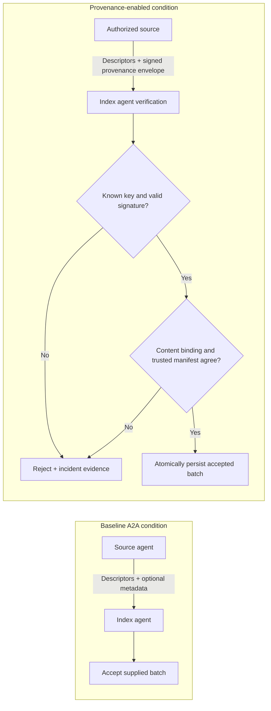
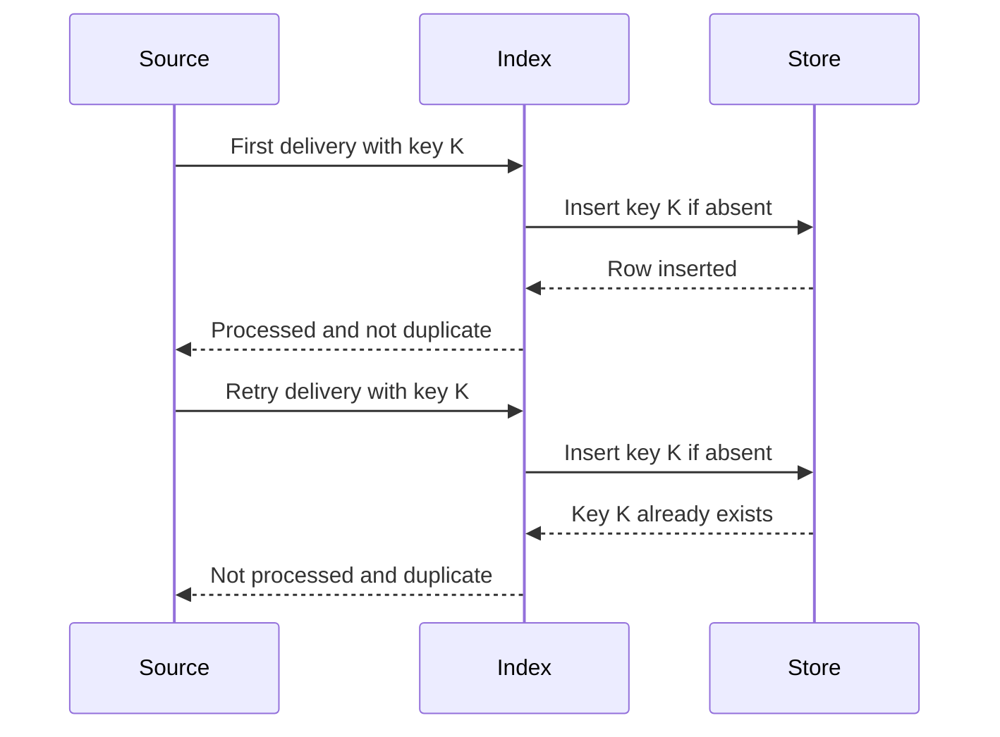
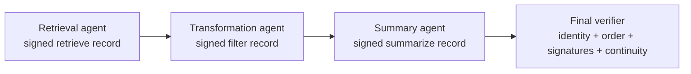

# Verifiable Dataset Provenance in Agent-to-Agent Exchanges

## Executive summary

This study evaluates an application-level provenance extension for Agent-to-Agent (A2A) dataset exchange. **Baseline A2A (unmodified A2A without the provenance-verification extension)** can carry arbitrary metadata, but it does not itself require a receiving agent to authenticate a source, bind provenance to content, or compare that content with a trusted manifest. The provenance-enabled condition adds a signed, versioned provenance envelope and enforces those checks before an index agent persists a dataset batch.

Across 120 observations in the recorded evaluation, the baseline condition accepted clean and manipulated inputs alike. The provenance-enabled condition accepted all ten clean observations and rejected all fifty observations involving missing provenance, post-signing alteration, forged identity, unknown keys, or manifest-conflicting content. A separate retry experiment showed that two deliveries of one logical batch produced one durable write. The result is a concrete feasibility demonstration of provenance enforcement at the application layer; it is not a claim that baseline A2A already supplies this guarantee.

## Research question and hypotheses

**Research question.** Can provenance be carried and verified in an A2A exchange so that a receiving agent can determine the claimed origin and integrity of received dataset information, and reject information whose provenance is missing, altered, forged, unverifiable, or inconsistent with trusted content records?

| ID | Hypothesis | Evaluation criterion | Recorded result |
| --- | --- | --- | --- |
| H1 | The baseline condition does not enforce the proposed provenance policy. | It accepts supplied descriptors irrespective of provenance manipulation. | Supported: 60/60 baseline observations accepted. |
| H2 | The provenance-enabled condition accepts a valid, trusted batch. | Every clean provenance-enabled observation is accepted. | Supported: 10/10 accepted. |
| H3 | The provenance-enabled condition detects the five modeled provenance or integrity failures. | Every manipulated provenance-enabled observation is rejected through the relevant verification path. | Supported: 50/50 rejected. |
| H4 | A stable application key prevents retrying an accepted batch from duplicating its durable write. | Two same-key deliveries yield one persisted row and an explicit duplicate response. | Supported for the tested SQLite write. |

## Baseline and provenance-enabled conditions



The envelope binds the source identity, signing key, run identifier, message identifier, and descriptor content. The receiver evaluates that envelope against a local trust registry and independently trusted manifest. These are testbed trust roots and application checks; an A2A Agent Card or a valid signature alone does not establish that a dataset is true.

## Experimental design

The evaluation crosses two policy conditions with six deterministic scenarios. Each of the twelve cells is repeated ten times.

- **Baseline condition:** accepts the supplied descriptors without enforcing provenance. This is the unmodified-A2A comparison, not a provenance mechanism.
- **Provenance-enabled condition:** verifies the signed envelope, registered source and key, content binding, and trusted manifest before persistence.
- **Primary outcome:** accept or reject decision for each batch.
- **Retry outcome:** whether two transport deliveries with one stable application key create one or two durable records.

### Twelve-cell correctness matrix

| Scenario | Manipulation | Baseline condition | Provenance-enabled condition |
| --- | --- | ---: | ---: |
| Clean | Valid descriptors and signed envelope | 10/10 accepted | 10/10 accepted |
| Missing provenance | Provenance envelope removed | 10/10 accepted | 10/10 rejected |
| Content substitution | Descriptor changed after signing | 10/10 accepted | 10/10 rejected |
| Forged identity | Source identity changed without a valid signature | 10/10 accepted | 10/10 rejected |
| Unknown key | Envelope signed by an unregistered key | 10/10 accepted | 10/10 rejected |
| Manifest conflict | Authorized source signs content conflicting with the trusted manifest | 10/10 accepted | 10/10 rejected |

The central empirical pattern is therefore:

| Condition | Clean inputs | Manipulated inputs | Total |
| --- | ---: | ---: | ---: |
| Baseline condition | 10/10 accepted | 50/50 accepted | 60/60 accepted |
| Provenance-enabled condition | 10/10 accepted | 50/50 rejected | 60/60 policy-consistent |

## Duplicate delivery and idempotency

A transport message identifier describes one delivery attempt; an application idempotency key identifies the intended logical write. A retry may use a new transport identifier while retaining the same application key.



| Check | Fresh result |
| --- | --- |
| Same-key delivery attempts | 2 |
| Transport identifiers distinct | Yes |
| First delivery processed | Yes |
| Retry processed | No |
| Retry explicitly marked duplicate | Yes |
| Durable rows after both deliveries | 1 |
| Unique-key controls | Both processed; two additional rows |

This establishes idempotency for the accepted-batch SQLite insert. It does not prove exactly-once transport or protect future side effects outside that transaction.

## Experimental infrastructure

The twelve condition/scenario cells are independent. For reproducible local execution, the harness first runs them sequentially and then uses **Ray Core**, a Python task-execution framework, to schedule up to four cells concurrently. Each task owns an ephemeral A2A index process and a separate SQLite workset. Ray is an evaluation tool used here to learn local AI-infrastructure orchestration; it is not part of the provenance design or scientific contribution.

The fresh run produced identical decision vectors in sequential and concurrent execution: **120/120 outcomes matched**. Secondary engineering measurements are retained to characterize the run, not to support the provenance hypothesis.

| Engineering measure | Sequential | Concurrent task execution |
| --- | ---: | ---: |
| Observations | 120 | 120 |
| Wall time | 9.7788 s | 7.3135 s |
| Observations per second | 12.27 | 16.41 |
| Driver CPU time | 2.76 s | 0.18 s |
| Driver peak RSS | 105.8 MiB | 118.8 MiB |

The observed local wall-time ratio was **1.337×** (**1.34×** rounded), with framework initialization included. The [fresh generated report](results/ray/20260925T050809Z/RESULTS.md) and [`ray-demo-results.json`](ray-demo-results.json) preserve the evidence.

## Limitations

1. **Application-layer scope.** The provenance-enabled condition demonstrates checks implemented by this testbed; it does not modify the A2A specification or show that baseline A2A guarantees provenance.
2. **Local trust assumptions.** The registry and manifest are fixture trust roots. Signature validity authenticates a key and content binding, not the truth or scientific quality of a dataset.
3. **Scenario coverage.** Six deterministic scenarios establish feasibility, not comprehensive adversarial coverage.
4. **Narrow idempotency boundary.** Deduplication protects one durable write; failure timing and external side effects are not yet modeled.
5. **Single-machine engineering data.** Timing varies with startup, background load, and operating-system scheduling. No multi-node scalability claim is made.
6. **Partial resource accounting.** CPU and memory values describe the driver, not the full worker and subprocess tree.

## Study 1 conclusion

The provenance-enabled condition made source and integrity checks enforceable at the receiving agent: valid trusted batches were accepted, while all modeled provenance and manifest failures were rejected. The baseline condition carried the messages but did not enforce those decisions. The retry experiment further showed one durable effect for two deliveries of the same logical batch.

## Study 2: three-agent provenance lineage

This completed follow-up asks: after multiple agents retrieve, transform, and summarize information, can the final verifier reconstruct who contributed what, which transformations occurred, and whether the lineage was altered?

### Design

Three logical agents append signed transformation records. Each record binds its sequence number, acting identity and key, transformation, input and output digests, run and delivery identifiers, and the digest of the prior signed record.



| Condition | Submitted lineage | Expected result |
| --- | --- | --- |
| Clean provenance-enabled chain | Records 1 → 2 → 3 | Reconstruct all contributors and transformations; accept. |
| Missing-middle-record attack | Records 1 → 3; record 2 removed | Detect the sequence and digest-link break; reject with `missing_intermediate_record`. |
| Altered-transformation attack | Record 2's transformation label changed after signing | Reject with `invalid_signature`; the signed content no longer verifies. |
| Reordered-records attack | All records retained but submitted 1 → 3 → 2 | Reject with `record_order_failure`; all records exist but their sequence is invalid. |
| Baseline condition | Pass-through without lineage verification | Accept all submitted payloads; provides no lineage enforcement. |

Ray Core scheduled the forty independent local trials across four workers. It served only as the actor/concurrency harness; the signed lineage and its verification behavior are the research objects.

### Fresh measured findings

Ten repetitions were run for each of the four scenarios. Raw observations and SQLite worksets are in the [fresh generated run](results/lineage/20260925T191429Z/); the compact checked-in evidence is [`lineage-demo-results.json`](lineage-demo-results.json).

| Metric | Result | Interpretation |
| --- | ---: | --- |
| Clean acceptance | 10/10 (100%) | Every complete lineage verified. |
| Missing-middle detection | 10/10 (100%) | Every broken chain was rejected for the intended reason. |
| Altered-transformation detection | 10/10 (100%) | Every post-signing mutation produced `invalid_signature`. |
| Reordered-record detection | 10/10 (100%) | Every 1 → 3 → 2 chain produced `record_order_failure`. |
| Attacks accepted by baseline condition | 30/30 (100%) | Unmodified pass-through did not inspect lineage. |
| Overall attack detection | 30/30 (100%) | Each attack produced its scenario-specific rejection. |
| False-rejection rate | 0/10 (0%) | No valid clean chain was rejected. |
| Clean lineage completeness | 100% | Three of three expected records verified. |
| Attacked verified-prefix completeness | 33.3% | Record 1 verified before each attack was encountered. |
| Median verification time | 0.436 ms | Local cryptographic and structural checks. |
| p95 verification time | 0.717 ms | Ten clean and thirty attacked trials combined. |
| Median overhead vs. minimal pass-through | 0.436 ms | Engineering estimate; the baseline decision is intentionally minimal. |
| Median signed lineage size | 2,045 bytes | Three signed transformation records. |
| Durable consistency under retry | 10/10 (100%) | Two same-key persistence attempts converged to one row. |

Signatures authenticate registered keys and protect the signed record structure; they do not establish that a transformation is scientifically correct or that its output is true. Timing comes from one machine and is not evidence of multi-node scalability.

## Combined conclusions and remaining work

Across both completed studies, the baseline condition carried supplied messages but did not enforce provenance. The provenance-enabled condition authenticated a source-to-index envelope in Study 1 and reconstructed a complete digest-linked transformation chain in Study 2. It rejected all tested single-hop manipulations and every tested missing, altered, or reordered multi-hop lineage, while durable idempotency produced one logical write under retry.

The missing, altered, and reordered multi-hop objectives are complete. Remaining research should add unauthorized inserted agents, revoked or rotated keys, and duplicate or out-of-order transformation delivery. It should also inject failures around commit boundaries, evaluate per-claim lineage within mixed-source outputs, and replace fixture trust roots with a documented governance and key-distribution model.

## Reproduction

From the repository root:

```bash
source venv/bin/activate
pip install -r requirements.txt

# Unit tests for attribution and durable idempotency
python -m unittest discover -s tests -v

# Sequential baseline-versus-provenance-enabled comparison
python harness/datasets.py --compare --repetitions 10

# Re-run the matrix sequentially and concurrently, then test duplicate delivery
python harness/ray_datasets.py --repetitions 10 --workers 4

# Three-agent clean lineage plus missing, altered, and reordered attacks
python harness/lineage.py --repetitions 10 --workers 4
```

Generated observations, SQLite worksets, and reports are written under `results/`. Study 1 evidence is at [`results/ray/20260925T050809Z/`](results/ray/20260925T050809Z/) with snapshot [`ray-demo-results.json`](ray-demo-results.json). Study 2 evidence is at [`results/lineage/20260925T191429Z/`](results/lineage/20260925T191429Z/) with snapshot [`lineage-demo-results.json`](lineage-demo-results.json).
